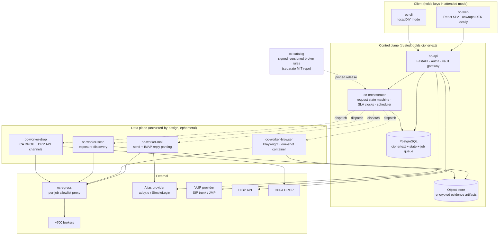
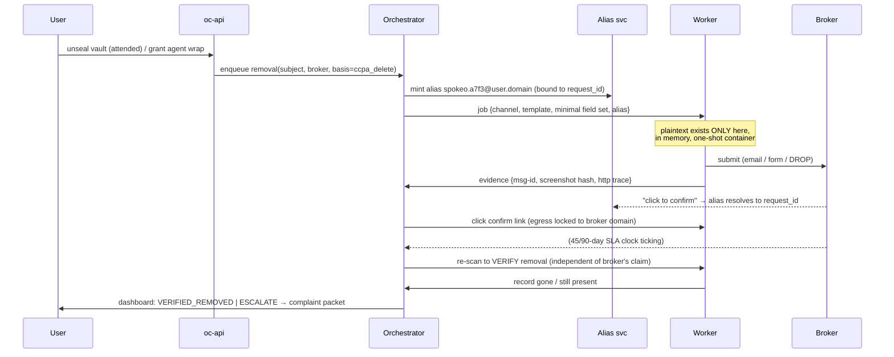
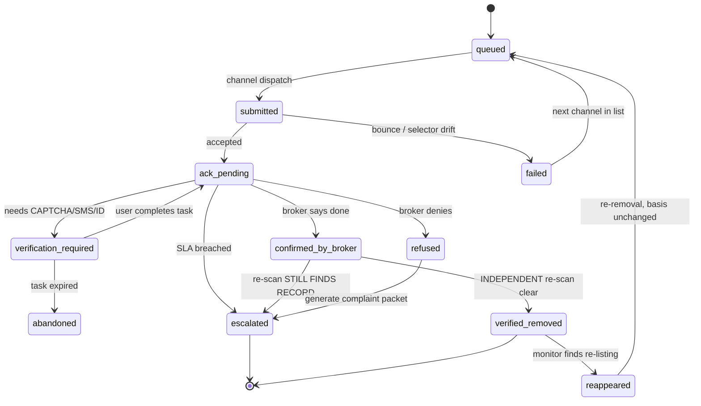

# OpenCloak — System Design

**An open-source, self-hostable alternative to Cloaked: data-broker removal, ongoing monitoring, email/phone aliasing, and breach alerting.**

Status: design document, v0.1
Date: 2026-08-09
Audience: implementers and reviewers

---

## 0. Executive summary and the one idea that matters

Most "delete me from data brokers" tools are built as **scraper farms**: a headless browser per broker, filling opt-out forms, fighting CAPTCHAs and bot detection. That architecture is expensive, fragile, legally gray, and it loses the arms race by construction — you are automating someone else's website against their wishes, forever.

OpenCloak inverts the priority:

> **Statute is the API. Browser automation is the fallback of last resort.**

A CCPA deletion request sent by email to a broker's designated privacy address is legally binding, cannot be CAPTCHA'd, cannot be rate-limited away, creates a paper trail, and starts a 45-day clock enforceable by a regulator. A form-fill on Spokeo's website is none of those things. As of **August 1, 2026**, California's **DROP** (Delete Request and Opt-out Platform) goes further: a single verified consumer request now propagates to **every data broker registered with the CPPA (~600+)**, who must check DROP every 45 days and delete within 90. That is the single highest-leverage channel that has ever existed for this problem, and it is a first-class citizen in this design.

Browser automation still matters — for the ~50 people-search sites that drive most of the felt harm (Whitepages, Spokeo, Radaris, BeenVerified, TruePeopleSearch…) and that will honor only their own form. But it is *one channel among five*, chosen per-broker by a cost/reliability policy, not the architecture.

The second organizing idea:

> **Aliases are not a separate product. They are the removal engine's correlation and containment layer.**

Every opt-out submission goes out from a **per-broker email alias**. That alias is the request's correlation token (confirmation links route themselves to the right pending request), the containment boundary (a broker that leaks or sells its opt-out list burns one alias, not your identity), and the detection signal (mail to `spokeo.a7f3@your.domain` from a *different* company proves resale). The same holds for phone.

The third, and the one that governs the security model:

> **You cannot fill out a form with data you cannot read.** Any system that automates opt-outs on your behalf while you sleep must hold your plaintext identity at that moment. "Zero-knowledge" claims that ignore this are marketing. OpenCloak makes the tradeoff explicit and user-selectable (§5.3): **attended mode** (true client-held keys, work happens while you're logged in), **local mode** (workers run on your hardware), **unattended mode** (an agent key can unwrap your vault; documented as such, off by default).

---

## Table of contents

1. [High-level architecture](#1-high-level-architecture)
2. [Tech stack](#2-tech-stack)
3. [Database schema](#3-database-schema)
4. [The broker catalog and removal engine](#4-the-broker-catalog-and-removal-engine) ← *the deep dive*
5. [Security and privacy design](#5-security-and-privacy-design)
6. [Legal and compliance posture](#6-legal-and-compliance-posture)
7. [MVP vs. later phases](#7-mvp-vs-later-phases)
8. [Implementation roadmap](#8-implementation-roadmap)
9. [Hard problems and how to solve them](#9-hard-problems-and-how-to-solve-them)
10. [What to reuse instead of building](#10-what-to-reuse-instead-of-building)

---

## 1. High-level architecture

### 1.1 Component map



### 1.2 The five channels, in preference order

The orchestrator picks the cheapest viable channel per broker. This ordering *is* the removal engine's core policy.

| # | Channel | Reach | Fragility | Legal weight | Cost |
|---|---------|-------|-----------|--------------|------|
| 1 | **CA DROP** (statutory clearinghouse) | ~600 registered brokers, one request | Very low | Statutory, regulator-enforced | ~0 |
| 2 | **DRP API** (Data Rights Protocol) | Few adopters, growing | Very low | Contractual + statutory | ~0 |
| 3 | **Email** to designated privacy/DPO address | Long tail, ~700 brokers | Low (address rot) | Statutory (CCPA §1798.105, GDPR Art. 17) | ~0 |
| 4 | **Web form** (Playwright) | ~50 people-search sites that ignore 1–3 | **High** — breaks weekly | Whatever their form promises | High |
| 5 | **Human-in-the-loop** (CAPTCHA, SMS/ID verify, postal) | Stubborn brokers | N/A | Varies | User's attention |

Design consequence: **a broker's catalog entry lists channels in preference order**, and the engine walks down that list on failure. A broker that is CPPA-registered *and* has a privacy email gets its work done by channels 1 and 3 at near-zero marginal cost; the browser fleet's budget is spent only where it must be.

### 1.3 Data flow: one removal, end to end



Note the two properties that most tools lack: **removal is verified independently** (never trust the broker's "done" email), and **missing the statutory deadline auto-generates a regulator complaint packet** rather than silently failing.

### 1.4 Trust boundaries

| Zone | Holds | Trusted with plaintext PII? |
|---|---|---|
| Client | Passphrase, KEK, unwrapped DEK | Yes (it's the user's) |
| `oc-api` / `oc-orchestrator` | Ciphertext, state, job metadata | Only transiently, attended mode |
| Workers | One job's minimal field set, in RAM | Yes, ephemerally — **highest-risk zone** |
| `oc-egress` | TLS metadata, per-job allowlist | No |
| Postgres / object store | Ciphertext only | **No** — a full DB dump must be useless |
| Catalog repo | Public broker rules | No user data ever |

The browser worker is the crown-jewel risk: it simultaneously holds plaintext identity *and* executes hostile third-party JavaScript. §5.4 hardens it accordingly.

---

## 2. Tech stack

Boring, proven, and — importantly — chosen so that **a volunteer can contribute a broker rule without being a systems programmer**, because catalog contribution volume is the project's actual survival constraint.

| Layer | Choice | Why |
|---|---|---|
| Core language | **Python 3.12** | Playwright's Python binding is first-class; stdlib `email`/MIME for the primary channel; the contributor pool for a privacy-tooling catalog writes Python and YAML. Runner-up: Go (better single-binary self-host story — see note below). |
| API | **FastAPI + Pydantic v2** | Typed request/response, OpenAPI for free, async fits I/O-bound broker work. |
| ORM / migrations | **SQLAlchemy 2.0 + Alembic** | Boring, explicit, no magic. |
| Database | **PostgreSQL 16** | One datastore. Row-level security available for the multi-tenant community-instance case; `bytea` for ciphertext; JSONB for catalog snapshots. |
| Queue | **Postgres-backed (`procrastinate`)**, `SELECT … FOR UPDATE SKIP LOCKED` | Transactional enqueue — job creation and state-machine transition commit atomically, which is exactly what a multi-day workflow with SLA clocks needs. Avoids adding Redis as a durability-critical dependency. Celery+Redis is the familiar alternative if the team prefers it; do not use Redis as the *system of record*. |
| Cache / rate limits | **Redis** (optional, non-durable) | Per-domain token buckets, session unseal cache with TTL. Nothing lost if it's flushed. |
| Browser automation | **Playwright** (Chromium) | Auto-waiting, accessible/semantic locators (`get_by_role`, `get_by_label`) which survive CSS churn far better than XPath, first-class tracing (`trace.zip`) that doubles as evidence, and per-context isolation. Not Selenium (flakier waits), not raw CDP. |
| Browser pooling | One-shot containers via **Docker/K8s Job**, not a long-lived grid | No cross-user profile bleed; a compromised page dies with the container. |
| Human handoff | **noVNC** over the worker's X session, or Playwright screencast to the SPA | Lets the user solve a CAPTCHA *inside* the live session instead of the job failing. |
| Frontend | **React 18 + Vite + TanStack Query + Tailwind** | The client must do real crypto (WebCrypto, unwrap DEK) — an SPA is the right shape. Boring, huge hiring/contributor pool. |
| Client crypto | **WebCrypto** (AES-GCM, HKDF) + **argon2-browser** (WASM) | No hand-rolled crypto. Argon2id for KDF. |
| Object storage | **S3-compatible (MinIO self-host)** | Encrypted evidence blobs; lifecycle rules give retention for free. |
| Mail send | **Postfix relay → transactional provider**, DKIM/SPF/DMARC on a dedicated domain | §9.4 — deliverability of the opt-out email is the #1 silent failure mode. |
| Mail receive | **IMAP poll** (works with any provider) + optional LMTP hook | Reply/confirmation parsing. |
| Aliasing | **addy.io** or **SimpleLogin**, self-hosted, behind an `AliasProvider` interface | Do not rebuild. §10. |
| Secrets | **SOPS + age** for compose; optional Vault | No hard dependency on Vault for a home instance. |
| Deploy | **Docker Compose** (primary) + **Helm chart** (optional) | Compose is the self-hoster's lingua franca. |
| Reverse proxy | **Caddy** | Automatic TLS, three-line config. |
| Observability | **OpenTelemetry → Prometheus + Grafana**, structured logs with a **PII redaction filter in the logging pipeline itself** | Never rely on developers remembering not to log PII; enforce it at the handler. |

**Note on Go:** a Go core would give self-hosters a single static binary and would let us fork `eraser` (§10) wholesale. The recommendation is still Python, but this is the closest call in the stack. A defensible hybrid: **Go for `oc-api`/`oc-orchestrator`, Python for workers and catalog tooling.** Only take that path if the team has Go depth; two languages doubles the contribution barrier.

**Explicitly rejected:** Temporal (excellent fit for long-running human-in-the-loop workflows, but too heavy to ask a self-hoster to run — revisit for the hosted tier); Kafka (nothing here needs it); a graph DB (the relatives-graph is small); an LLM in the hot path (non-deterministic form filling with someone's SSN is unacceptable — see §4.6 for where LLMs *do* belong).

---

## 3. Database schema

Design rules:

1. **No plaintext PII in Postgres. Ever.** A full `pg_dump` must be commercially useless.
2. **Field-level, not row-level, encryption** — so a job that needs `first_name, city, state` never unwraps `date_of_birth`.
3. **Store field *types* and hashes, not values,** for anything derived from scraping. The scanner must not turn OpenCloak into a data broker.
4. **Append-only, hash-chained evidence**, because the output is sometimes a regulatory complaint.
5. **Crypto-shredding** as the deletion primitive.

### 3.1 Identity vault

```sql
CREATE TABLE users (
    id              uuid PRIMARY KEY DEFAULT gen_random_uuid(),
    email           citext UNIQUE NOT NULL,       -- login only; may itself be an alias
    auth_hash       text NOT NULL,                -- argon2id, distinct salt from KEK
    created_at      timestamptz NOT NULL DEFAULT now()
);

-- One DEK per subject, stored only in wrapped form. Multiple wraps = multiple ways in.
CREATE TABLE dek_wraps (
    id              uuid PRIMARY KEY DEFAULT gen_random_uuid(),
    subject_id      uuid NOT NULL REFERENCES subjects(id) ON DELETE CASCADE,
    wrap_type       text NOT NULL CHECK (wrap_type IN
                        ('passphrase','recovery_code','agent_key','hardware_token')),
    wrapped_dek     bytea NOT NULL,               -- AES-256-GCM(KEK, DEK)
    kdf_params      jsonb NOT NULL,               -- argon2id: m, t, p, salt
    key_id          text NOT NULL,                -- for agent_key: KMS key reference
    created_at      timestamptz NOT NULL DEFAULT now(),
    revoked_at      timestamptz
);
-- Deleting every row here is an irreversible crypto-shred of the subject.

-- The person being protected. Usually the user; may be a consenting family member.
CREATE TABLE subjects (
    id                  uuid PRIMARY KEY DEFAULT gen_random_uuid(),
    user_id             uuid NOT NULL REFERENCES users(id) ON DELETE CASCADE,
    label               text NOT NULL,            -- "me", "spouse" — NOT a real name
    relationship        text NOT NULL CHECK (relationship IN ('self','household','minor_ward','other')),
    authorization_id    uuid REFERENCES authorizations(id),  -- REQUIRED unless 'self'
    jurisdictions       text[] NOT NULL DEFAULT '{}',        -- ['US-CA','EU-DE'] → drives legal basis
    created_at          timestamptz NOT NULL DEFAULT now()
);

CREATE TYPE field_type AS ENUM (
    'given_name','family_name','middle_name','name_variant','maiden_name',
    'street','city','state','postal_code','country','address_history',
    'email','phone','date_of_birth','birth_year','age',
    'employer','relative_name','profile_photo','username','ssn_last4'
);

CREATE TABLE identity_fields (
    id              uuid PRIMARY KEY DEFAULT gen_random_uuid(),
    subject_id      uuid NOT NULL REFERENCES subjects(id) ON DELETE CASCADE,
    field           field_type NOT NULL,
    ciphertext      bytea NOT NULL,   -- AES-256-GCM; AAD = subject_id||field||id
    nonce           bytea NOT NULL,
    blind_index     bytea,            -- HMAC-SHA256(K_bi, normalize(v)); HIGH-ENTROPY FIELDS ONLY
    sensitivity     smallint NOT NULL DEFAULT 1 CHECK (sensitivity BETWEEN 1 AND 3),
    is_current      boolean NOT NULL DEFAULT true,
    source          text NOT NULL CHECK (source IN ('user_entered','user_confirmed_from_exposure')),
    created_at      timestamptz NOT NULL DEFAULT now()
);
CREATE INDEX ON identity_fields (subject_id, field) WHERE is_current;
CREATE INDEX ON identity_fields (blind_index) WHERE blind_index IS NOT NULL;
```

**On `blind_index`:** only ever populate it for `email`, `phone`, and full-name+DOB composites. A blind index over `state` or `birth_year` is a rainbow table with extra steps — 50 and ~100 possible plaintexts respectively. This is a common and serious mistake in encrypted-field designs; the schema encodes the rule and CI enforces it.

**On `ssn_last4`:** present in the enum because a handful of brokers demand it, and *absent* from the default UI. It is sensitivity 3, never included in any auto-generated payload, and requires a per-request explicit user confirmation. Full SSN is not representable in this schema by design — if a broker requires one, the correct answer is to escalate to a regulator, not to hand it over.

### 3.2 Broker catalog (a versioned, read-only snapshot)

```sql
CREATE TABLE catalog_versions (
    id              uuid PRIMARY KEY DEFAULT gen_random_uuid(),
    version         text UNIQUE NOT NULL,          -- "2026.08.1"
    signature       bytea NOT NULL,                -- cosign / sigstore bundle
    imported_at     timestamptz NOT NULL DEFAULT now(),
    is_active       boolean NOT NULL DEFAULT false
);

CREATE TABLE brokers (
    id                  text NOT NULL,             -- stable slug: "spokeo"
    catalog_version_id  uuid NOT NULL REFERENCES catalog_versions(id),
    name                text NOT NULL,
    domains             text[] NOT NULL,
    parent_org          text,                      -- mirror/parent graph, see §4.7
    categories          text[] NOT NULL,           -- people_search, marketing, risk, fcra_cra
    registry_ids        jsonb NOT NULL DEFAULT '{}',  -- {"cppa":"..","vt":"..","tx":"..","or":".."}
    legal_bases         text[] NOT NULL,           -- ccpa_delete, ccpa_opt_out, gdpr_erasure, drop_covered
    channels            jsonb NOT NULL,            -- ordered array, see §4.2
    reappearance_ttl    interval NOT NULL DEFAULT '90 days',
    difficulty          smallint NOT NULL DEFAULT 1,
    PRIMARY KEY (id, catalog_version_id)
);
```

Catalog data is snapshotted per version rather than mutated in place, so an in-flight request can always answer *"what rule was in effect when this was submitted?"* — which matters when a broker disputes a request.

### 3.3 Exposures — what the scanner is allowed to remember

```sql
CREATE TABLE exposures (
    id                  uuid PRIMARY KEY DEFAULT gen_random_uuid(),
    subject_id          uuid NOT NULL REFERENCES subjects(id) ON DELETE CASCADE,
    broker_id           text NOT NULL,
    profile_url_enc     bytea NOT NULL,            -- encrypted: the URL itself is identifying
    profile_url_hash    bytea NOT NULL,            -- HMAC, for dedupe without decryption
    matched_fields      field_type[] NOT NULL,     -- WHICH fields matched, NEVER their values
    match_confidence    numeric(3,2) NOT NULL,
    record_fingerprint  bytea NOT NULL,            -- hash of displayed content → detects re-listing
    state               text NOT NULL CHECK (state IN
                            ('found','removal_in_progress','removed','reappeared','not_mine','ignored')),
    first_seen          timestamptz NOT NULL DEFAULT now(),
    last_seen           timestamptz NOT NULL,
    UNIQUE (subject_id, broker_id, profile_url_hash)
);
```

`matched_fields` is the crux of rule 3: the dashboard can truthfully say *"Radaris lists your name, two past addresses, and a relative"* without OpenCloak ever storing those addresses or that relative's name. The scraped page itself goes into an encrypted artifact with a short retention, or is discarded after fingerprinting.

### 3.4 Removal requests and the evidence chain

```sql
CREATE TYPE removal_state AS ENUM (
    'queued','submitted','ack_pending','verification_required',
    'confirmed_by_broker','verified_removed','refused','no_match',
    'reappeared','escalated','failed','abandoned'
);

CREATE TABLE removal_requests (
    id                  uuid PRIMARY KEY DEFAULT gen_random_uuid(),
    subject_id          uuid NOT NULL REFERENCES subjects(id) ON DELETE CASCADE,
    broker_id           text NOT NULL,
    exposure_id         uuid REFERENCES exposures(id),
    catalog_version_id  uuid NOT NULL REFERENCES catalog_versions(id),
    legal_basis         text NOT NULL,
    channel             text NOT NULL,
    alias_id            uuid REFERENCES aliases(id),   -- correlation token
    state               removal_state NOT NULL DEFAULT 'queued',
    attempt             smallint NOT NULL DEFAULT 0,
    dedupe_key          text NOT NULL,   -- sha256(subject||broker||basis||period) — anti-spam
    submitted_at        timestamptz,
    sla_due_at          timestamptz,     -- statutory clock: 45d CCPA, 90d DROP, 30d GDPR
    closed_at           timestamptz,
    UNIQUE (dedupe_key)
);
CREATE INDEX ON removal_requests (state, sla_due_at) WHERE closed_at IS NULL;

-- Append-only. No UPDATE, no DELETE. Hash-chained per request.
CREATE TABLE request_events (
    id              bigserial PRIMARY KEY,
    request_id      uuid NOT NULL REFERENCES removal_requests(id) ON DELETE CASCADE,
    seq             integer NOT NULL,
    event_type      text NOT NULL,      -- submitted, bounced, captcha_hit, confirmed, rescan_clear…
    from_state      removal_state,
    to_state        removal_state,
    detail          jsonb NOT NULL DEFAULT '{}',   -- REDACTED: no PII, enforced by CI check
    artifact_id     uuid REFERENCES artifacts(id),
    prev_hash       bytea NOT NULL,
    hash            bytea NOT NULL,     -- sha256(prev_hash || canonical(this row))
    occurred_at     timestamptz NOT NULL DEFAULT now(),
    UNIQUE (request_id, seq)
);

CREATE TABLE artifacts (
    id              uuid PRIMARY KEY DEFAULT gen_random_uuid(),
    subject_id      uuid NOT NULL REFERENCES subjects(id) ON DELETE CASCADE,
    kind            text NOT NULL,      -- screenshot, playwright_trace, raw_email, pdf_form
    object_key      text NOT NULL,      -- S3 key; body encrypted to the subject DEK
    sha256          bytea NOT NULL,
    expires_at      timestamptz NOT NULL,   -- default now() + 180 days
    created_at      timestamptz NOT NULL DEFAULT now()
);
```

The hash chain means a user can hand a regulator an evidence bundle whose internal consistency is checkable — *"here are 14 timestamped events proving Broker X received a valid deletion request on 2026-08-09 and had not complied by 2026-09-23."*

### 3.5 Aliases, human tasks, authorizations, breaches

```sql
CREATE TABLE aliases (
    id              uuid PRIMARY KEY DEFAULT gen_random_uuid(),
    subject_id      uuid NOT NULL REFERENCES subjects(id) ON DELETE CASCADE,
    kind            text NOT NULL CHECK (kind IN ('email','phone')),
    provider        text NOT NULL,      -- addy_io, simplelogin, local_catchall, jmp, telnyx
    address         text NOT NULL,      -- the alias itself is not the user's PII
    bound_broker_id text,               -- one alias per broker
    purpose         text NOT NULL CHECK (purpose IN ('opt_out','signup','recovery')),
    state           text NOT NULL DEFAULT 'active',
    leak_detected_at timestamptz,       -- inbound from an unexpected sender → resale evidence
    created_at      timestamptz NOT NULL DEFAULT now(),
    UNIQUE (provider, address)
);

CREATE TABLE verification_tasks (
    id              uuid PRIMARY KEY DEFAULT gen_random_uuid(),
    request_id      uuid NOT NULL REFERENCES removal_requests(id) ON DELETE CASCADE,
    kind            text NOT NULL,      -- captcha, sms_code, id_upload, postal_mail, phone_call
    instructions    text NOT NULL,
    live_session_url text,              -- noVNC handoff for CAPTCHA
    expires_at      timestamptz NOT NULL,
    completed_at    timestamptz
);

-- Proof the user may act for this subject. Non-negotiable for anyone but 'self'.
CREATE TABLE authorizations (
    id              uuid PRIMARY KEY DEFAULT gen_random_uuid(),
    user_id         uuid NOT NULL REFERENCES users(id) ON DELETE CASCADE,
    scope           text NOT NULL,      -- self, household_adult, minor_ward
    document_id     uuid REFERENCES artifacts(id),   -- signed LOA
    attested_at     timestamptz NOT NULL,
    attestation_ip  inet,
    expires_at      timestamptz
);

CREATE TABLE breach_findings (
    id              uuid PRIMARY KEY DEFAULT gen_random_uuid(),
    subject_id      uuid NOT NULL REFERENCES subjects(id) ON DELETE CASCADE,
    source          text NOT NULL,      -- hibp, hibp_passwords, custom
    breach_name     text NOT NULL,
    breach_date     date,
    exposed_classes text[] NOT NULL,    -- ['email','password_hash'] — classes, not values
    identifier_hash bytea NOT NULL,     -- WHICH alias/email matched, hashed
    acknowledged_at timestamptz,
    UNIQUE (subject_id, source, breach_name, identifier_hash)
);
```

---

## 4. The broker catalog and removal engine

*This is the hard part and the reason the project exists. Everything above is scaffolding for this section.*

### 4.1 The catalog is a separately versioned, signed, MIT-licensed data product

The catalog lives in its own repository (`opencloak/broker-catalog`, **MIT**), not in the server repo, and ships like antivirus signatures or Suricata rules:

- **Versioned releases** (`2026.08.1`), published as a signed tarball + OCI artifact.
- **Cosign/sigstore signatures**; instances verify before import. A catalog entry drives a browser holding your identity — it is *executable-adjacent* and must be treated as supply chain.
- **Instances pin a version** and upgrade on their own schedule (`auto`, `manual`, `pin`).
- **MIT so that commercial competitors can and will use it.** This is deliberate: catalog quality is a function of contributor volume, and the fastest path to 700 accurate broker entries is to make it the industry's shared registry rather than a project asset. The *engine* is AGPL (§6.6); the *data* is MIT.

Seed it from authoritative sources rather than hand-curation (§10): the **CPPA registry CSV** is machine-readable, legally mandated, and refreshed annually — it gives the definitive list of ~600 registered brokers with contact and opt-out URLs, and `registry_ids.cppa` becomes the join key to DROP.

### 4.2 Catalog entry format

Declarative YAML with a strict JSON Schema (`catalog/schema/broker.schema.json` in this repo). **No arbitrary code in catalog entries** — a broker rule must not be able to execute Python on a machine holding user identity. Complex flows are expressed as a bounded step DSL; anything the DSL cannot express becomes a human task instead of an escape hatch.

```yaml
id: spokeo
name: Spokeo, Inc.
domains: [spokeo.com, www.spokeo.com]
parent_org: spokeo
categories: [people_search]
registry_ids:
  cppa: "..."        # joins to DROP coverage
legal_bases: [ccpa_delete, ccpa_opt_out, gdpr_erasure, drop_covered]
reappearance_ttl: 60d
difficulty: 3

discovery:
  method: site_search
  steps:
    - goto: "https://www.spokeo.com/{given_name}-{family_name}/{state}"
    - wait_for: { role: list, name: "search results" }
    - extract_records:
        container: { role: listitem }
        fields: { name: {role: heading}, age: {testid: age}, city: {testid: location} }
  match:
    required: [given_name, family_name]
    scoring: { family_name: 0.4, given_name: 0.25, city: 0.2, age_within_2y: 0.15 }
    min_confidence: 0.75

channels:
  - type: drop                     # 1. free, statutory, covers this broker
    covers_jurisdictions: [US-CA]

  - type: email                    # 2. works everywhere, no CAPTCHA
    to: privacy@spokeo.com
    template: ccpa_delete_v3
    required_fields: [given_name, family_name, city, state]
    reply_to: alias                # per-broker alias, always
    expect_ack_within: 10d
    sla_days: 45

  - type: web_form                 # 3. their own flow; fastest when it works
    url: https://www.spokeo.com/optout
    required_fields: [profile_url, email]   # NOTE: no name/DOB — see §4.5
    steps:
      - goto: "{profile_url}"
      - click: { role: link, name: "Do Not Sell My Info" }
      - fill: { label: "Email address", value: "{alias_email}" }
      - solve: captcha              # → human task, never an auto-solver by default
      - click: { role: button, name: "Opt out" }
      - assert_visible: { text: "check your email" }
    verification: [email_confirm]
    sla_days: 3

  - type: human                    # 4. last resort
    instructions_md: docs/spokeo-manual.md

verify_removal:
  method: recheck_discovery
  wait: 7d
  attempts: 3
```

Three details doing heavy lifting:

- **Semantic locators** (`role`, `label`, `testid`) rather than CSS/XPath. A redesign that changes class names breaks XPath selectors and leaves `get_by_role("button", name="Opt out")` working. This single choice is worth more than any anti-bot trick for long-term maintenance.
- **`assert_visible` after submission.** Without a positive assertion, a broken flow *silently reports success* — the worst possible failure, because the user believes they're protected. Every web-form channel MUST end in an assertion or the schema rejects it.
- **`required_fields` is a whitelist, not a suggestion.** The engine unwraps exactly these fields and no others (§4.5).

The schema in `catalog/schema/broker.schema.json` enforces all three, and its negative cases are tested: a `web_form` without `assert_visible`, a CSS/XPath locator, two verbs in one step, a `reply_to` that isn't `alias`, and an unrecognized field name are all rejected. One implementation gotcha, recorded so it isn't rediscovered: the schema's `unevaluatedProperties: false` fires alongside any failed type-specific branch and sorts first, so the catalog linter must print **every** error from `iter_errors()` — reporting only the first tells a contributor that `url` is unexpected when the real problem is a missing success assertion.

### 4.3 The state machine



The `confirmed_by_broker → escalated` edge is the honest one. Brokers routinely send "your information has been removed" while the record remains live or reappears on a sibling domain. **Broker self-report is an input, never a terminal state.**

Concurrency and safety:

- **Idempotency:** `dedupe_key = sha256(subject || broker || basis || period)`. Re-running a scan can never double-submit.
- **Politeness:** a global per-domain token bucket (default 1 request / 10s, 50/day). We are exercising a legal right, not stress-testing anyone; being a bad neighbor is how the email channel gets blocklisted.
- **Retry:** exponential backoff with jitter, max 3 attempts per channel, then fall to the next channel. `attempt` and every transition land in `request_events`.
- **SLA clocks:** a scheduled sweep over `(state, sla_due_at)` moves breached requests to `escalated` and renders a complaint packet (CPPA, state AG, or EU DPA depending on `subjects.jurisdictions`).

### 4.4 Channel implementations

**DROP (channel 1).** As of 2026-08-01, registered brokers must retrieve DROP requests every 45 days and delete within 90. The CPPA verifies California residency itself, and an authorized agent may assist *after* that verification. OpenCloak therefore does **not** try to proxy the verification: it walks the user through CPPA's own flow out-of-band, records the resulting request reference, then uses `registry_ids.cppa` to mark every covered broker as `submitted` via channel 1 — suppressing hundreds of redundant per-broker submissions and reserving the browser fleet for the non-registered long tail. For a California resident this is the largest single reduction in system cost and fragility available.

**DRP API (channel 2).** Implement the Data Rights Protocol `exercise` / `status` endpoints as a client, and test against **OSIRAA**, Consumer Reports' open-source reference authorized agent. Adoption is thin, but the integration is small and the direction of travel is right.

**Email (channel 3) — the workhorse.** Jinja2 templates per `legal_basis` and jurisdiction, containing: the statutory citation, the subject's minimal identifying set, an explicit statement that the sender is the consumer (or an authorized agent, with the authorization attached), the reply-to alias, and a demand for written confirmation within the statutory window. Outbound goes through a dedicated, DMARC-aligned domain (§9.4). Inbound is polled over IMAP and parsed by a small rules engine — `In-Reply-To`/`References` first, then the recipient alias, then fuzzy subject match — to bind replies back to `request_id`. Confirmation links are clicked in a locked-down browser context whose egress allowlist contains only that broker's domains.

**Web form (channel 4).** The DSL above compiles to Playwright steps. Every job: fresh container, fresh context, no persistent profile, trace recording on, egress restricted to the broker's domains, plaintext field set limited to `required_fields`, container destroyed at exit. Traces are stored as encrypted artifacts — they're both the debugging tool and the evidence.

**Human (channel 5).** A first-class outcome, not a failure. The task queue surfaces exactly what the user must do, pre-filled: for CAPTCHA, a **live noVNC handoff into the running browser session** so the user solves it in place and the automation continues; for SMS, the code lands on the phone alias and is parsed automatically where possible; for postal, a generated, pre-filled PDF plus the address; for ID upload, an explicit warning (§4.5) and a redaction helper that crops and watermarks the document `For <broker> opt-out only — 2026-08-09`.

**On CAPTCHA solvers:** OpenCloak ships no solving service and enables none by default. A pluggable interface exists (self-hosters may do as they like with their own accounts), documented with the honest caveat that it likely violates the broker's terms of service, and that the statutory email channel achieves the same legal result without the question. Fighting bot detection is a losing, escalating game whose prize is a result the law already guarantees you.

### 4.5 Data minimization inside the engine — the disclosure paradox

The perverse core of this problem: **to be forgotten, you must first identify yourself.** Some brokers ask for more than they held. Four mitigations, enforced in code:

1. **Record-URL targeting over identity submission.** If discovery found `spokeo.com/John-Smith/CA/12345`, submit *that URL*. It proves which record without transmitting a birth date. This is why `required_fields` for Spokeo's web form is `[profile_url, email]` and not a name.
2. **Whitelist unwrapping.** The orchestrator unwraps exactly the fields in `required_fields`. There is no code path from a job to the full vault. Requesting `date_of_birth` for a broker whose entry doesn't list it raises rather than falls back.
3. **Alias-by-default.** Never the real email or phone. The alias is per-broker, so the contact point is disposable and instrumented.
4. **A hard ceiling.** If a broker demands government ID or full SSN, the engine stops and asks. The catalog flags these (`difficulty: 5`) and the UI is blunt: *"This broker demands a government ID to honor a right you already have. You can comply, or you can file a complaint. Here is a pre-filled complaint."* Auto-submitting a driver's license to a company whose business model is selling identity data is a defect, not a feature.

The dashboard also shows a **net disclosure ledger** per broker — *fields they already published* vs. *fields you would newly reveal* — so the tradeoff is visible before submission rather than after.

### 4.6 Keeping 700 broker rules working

Broker flows break constantly. Five mechanisms, in order of importance:

**1. Canary personas (the load-bearing one).** The project maintains synthetic identities — project-owned domains, project-owned VoIP numbers, real addresses at a project PO box — that are deliberately seeded into broker databases. Nightly CI runs the **complete** discovery → opt-out → verify cycle for every broker against these canaries. Breakage is detected by the project, on project data, *before any user is affected*, with zero user PII involved. This is the mechanism that makes a volunteer-maintained catalog viable, and it should be built early (Phase 2), not late.

**2. Structural drift detection.** Each web-form run records a DOM structural fingerprint (tag/role skeleton, not content). A fingerprint change without an assertion failure raises a warning; an assertion failure hard-fails the job. Silent mis-submission is the enemy.

**3. Opt-in health telemetry.** Instances may report, per broker per channel, `{catalog_version, outcome, failed_step}` — no user identifier, no PII, k-anonymized with a reporting threshold. Aggregated into a public **broker health dashboard**. Off by default, one toggle, plainly explained.

**4. LLM-assisted repair, human-gated.** When a canary fails, a repair job feeds the *sanitized* DOM (canary data only, never a user's) to an LLM that proposes an updated locator or step list, runs it against the canary, and if green **opens a pull request** against the catalog repo. A human reviews and merges. The LLM never touches user data, never runs in a user's job path, and never auto-merges. This is the correct place for a model in this system: maintaining rules offline, not filling forms with someone's identity at runtime.

**5. Graceful degradation.** A broker whose web form has failed 3 consecutive canary runs is automatically demoted — its `web_form` channel is disabled in the next catalog release and traffic falls to `email`. Users keep getting removals through the legal channel while a human fixes the selector.

### 4.7 Verifying removal, and the reappearance treadmill

**Verification is independent by construction.** After a broker confirms, wait 7 days (cache/CDN lag), re-run discovery, and require a clean result — up to 3 attempts. Only then `verified_removed`.

**Mirrors and siblings.** Many "different" brokers are one company: the same database behind `radaris.com`, `newenglandfacts.com`, and a dozen regional skins. The catalog's `parent_org` field builds a mirror graph, and removals fan out across the whole family, verified per-domain. Removing yourself from one skin while nine others still list you is the standard failure mode of manual opt-out lists.

**Reappearance is expected, not exceptional.** Brokers re-ingest from upstream sources (voter files, property records, credit header data, marketing co-ops), so records return. `reappearance_ttl` per broker drives the re-scan schedule; a return triggers a fresh request. Where the re-listing is attributable to an upstream feed, tag it — because the highest-leverage intervention is often upstream (a state voter-file suppression, a USPS NCOA opt-out, `optoutprescreen.com`) rather than the hundredth removal from the same downstream skin.

**FCRA is a different animal, handled separately.** Consumer reporting agencies (LexisNexis, Sagestream, Innovis, the big three) are *not* data brokers in the CCPA sense — CCPA carves out FCRA-regulated data, and a deletion request to them is the wrong instrument. The correct instruments are security freezes and FCRA disclosure requests. OpenCloak ships this as a distinct, clearly-labeled module with its own flows. Tools that blur this line generate requests that are ignored, and users who think they're protected when they aren't.

---

## 5. Security and privacy design

### 5.1 Threat model

| Adversary | Wants | Primary mitigation |
|---|---|---|
| **The broker** | More data; to fingerprint and re-identify you; to sell the opt-out list | Minimal field sets, per-broker aliases, record-URL targeting, leak detection via alias provenance |
| **Instance operator** (hosted/community) | (Or is compelled to produce) user identity data | Client-held keys in attended mode; published visibility matrix; crypto-shred; local mode as the paranoid's escape hatch |
| **Network attacker** | Traffic interception, MITM | TLS everywhere, pinned CA bundle, egress proxy, HSTS |
| **Other tenants** on a community instance | Cross-user data | Separate DEKs per subject, Postgres RLS, no shared browser profiles |
| **A hostile broker page** | RCE / SSRF from the worker into the control plane | One-shot containers, seccomp, no host mounts, no DB credentials in workers, egress allowlist |
| **Catalog supply chain** | Ship a malicious rule that exfiltrates identity | Signed releases, two-maintainer review, no code in rules, canary-tested, egress allowlist bounds the blast radius |
| **An abuser** | Use OpenCloak against someone else | Authorization artifacts, verification, rate limits (§6.5) |

### 5.2 Key hierarchy

```
passphrase ──argon2id(m=64MiB,t=3,p=4)──▶ KEK_user ─┐
recovery code (128-bit, printable) ──HKDF──▶ KEK_rec ─┼──▶ unwrap ──▶ DEK_subject
agent key (KMS/age, OPTIONAL) ─────────────▶ KEK_agt ─┘                    │
                                                                            ▼
                              AES-256-GCM per field, AAD = subject_id||field||row_id
```

- Each wrap is an independent path to the same DEK; revoking one (e.g. disabling unattended mode) deletes that row and nothing else.
- **AAD binding** prevents an attacker with DB write access from swapping one field's ciphertext into another row.
- **Crypto-shred:** delete all `dek_wraps` for a subject → every ciphertext is permanently unreadable, including in backups. This is how OpenCloak honors *its own* deletion obligation, and it's the only deletion primitive that works against a backup you don't control.
- Keys are versioned; re-wrapping on passphrase change never touches field ciphertext.

### 5.3 The three operating modes — stated honestly

| | **Local (DIY)** | **Attended (hosted)** | **Unattended (hosted)** |
|---|---|---|---|
| Where workers run | Your hardware | Server | Server |
| Who can read plaintext | Only you | Server, while you're logged in | Server, any time |
| Works while you sleep | Yes | No — jobs queue until next login | Yes |
| Operator can be compelled to produce your identity | No | Only during a session | **Yes** |
| Default | ✅ | ✅ for hosted | ❌ opt-in, with an interstitial |

In attended mode the client unwraps the DEK with WebCrypto and posts it to a short-TTL server-side session cache (Redis, 30 min, no disk, evicted on logout). This is **time-boxed exposure, not zero-knowledge**, and the UI says exactly that. Any documentation that claims otherwise is a bug.

Unattended mode is what makes "set it and forget it" work, and it is what every commercial competitor does silently. OpenCloak's contribution is not pretending the tradeoff away: the toggle explains, in one screen, precisely what the operator gains the ability to see.

### 5.4 Hardening the browser worker

The worker holds plaintext identity while executing adversarial JavaScript. Non-negotiables:

- One-shot container per job; destroyed on completion; `--read-only` root, `tmpfs` for the profile, `no-new-privileges`, seccomp profile, non-root user, no host mounts, dropped capabilities.
- **No database credentials, no object-store credentials, no service tokens.** The job payload arrives over a narrow, authenticated channel and results go back the same way. A fully compromised worker learns one job's fields, not the fleet's.
- **Per-job egress allowlist** enforced at `oc-egress` (a filtering forward proxy): only the broker's declared domains resolve, DNS is pinned, everything else is refused and logged. Also the SSRF and exfiltration control.
- No shared cookie jar, no `localStorage` reuse, no shared cache — cross-broker linkage via browser state would undo the aliasing.
- Screenshots pass a redaction step before storage; traces are encrypted to the subject DEK.

### 5.5 Additional controls

- **PII redaction in the logging pipeline**, as a handler-level filter with a CI test asserting that known identity values never appear in logs. Discipline is not a control.
- **RLS in Postgres** for community instances: every query scoped by `subject_id` at the database, not just in the ORM.
- **Reproducible builds** and published image digests; the hosted instance runs the same digest as the public artifact so users can verify.
- **`/security.txt`**, coordinated disclosure policy, and a `SECURITY.md` from day one — a privacy tool without a disclosure process is a liability.
- **Retention defaults:** artifacts 180 days, raw scraped pages 7 days, request events forever (they're the evidence, and they contain no PII by CI-enforced rule).

---

## 6. Legal and compliance posture

*Not legal advice; the project should retain counsel before operating a hosted mode.*

### 6.1 How the software presents itself

> "OpenCloak helps you exercise privacy rights you already have. It is a tool, not a law firm, and it does not guarantee removal."

Concretely: no "military-grade," no "we delete you from the internet," no invented removal percentages. Ship a **capability honesty page** stating what does and does not work — that some brokers refuse, that FCRA agencies are separate, that records reappear, that "dark web monitoring" is largely a marketing term for breach-corpus lookups.

### 6.2 Authorized agent

- **Self-hosted: the user is their own agent.** Cleanest possible posture — no agency relationship, no registration question, no third-party handling of anyone else's data. This is a strong argument for making self-hosting the flagship mode.
- **Hosted: the operator is an authorized agent** and inherits real obligations: written consumer authorization on file, permitting the business to verify the consumer directly, using the data for no other purpose, and — for California DROP — the constraint that an agent may only assist *after CPPA has verified the consumer's residency*. Every outbound request in hosted mode attaches the authorization artifact.

### 6.3 Jurisdiction-aware legal basis

`subjects.jurisdictions` selects the citation and the clock: CCPA/CPRA deletion and opt-out-of-sale for California (45 days, +45 extension); the Delete Act/DROP path for CA residents; GDPR Art. 17 erasure and Art. 21 objection for the EU/UK (1 month); and the growing set of US state regimes (Colorado, Connecticut, Texas, Oregon, Virginia…) with their own registries and windows. Non-covered users still send requests — many brokers apply their process uniformly rather than maintain per-state logic — but the UI must not imply an enforceable right where none exists.

Also emit **Global Privacy Control** signals from any browser context the project controls; in California GPC is a legally binding opt-out signal and it costs one header.

### 6.4 Terms of service and CFAA

Automating a broker's own opt-out form may breach that site's ToS. Post-*Van Buren*, CFAA exposure for accessing a public page is low but not zero, and the project should not pretend otherwise. Policy:

- Never circumvent a technical access control (no auth bypass, no paywall evasion).
- Prefer statutory channels; browser automation is opt-in per broker at the instance level.
- Identify the agent — requests state they are submitted by OpenCloak on the consumer's behalf. A tool exercising a legal right has no reason to hide.
- Respect `robots.txt` for discovery crawling, and rate-limit conservatively.

### 6.5 Anti-abuse — the obligation nobody talks about

A system that submits identity-bearing requests about a named person is an abuse vector in two directions: erasing a target's records, and *feeding a target's PII to 700 brokers* under the guise of an opt-out. Required controls:

- No subject other than `self` without a stored, signed authorization artifact.
- Verified control of the subject's email/phone before any submission on their behalf.
- Per-user and per-instance rate limits; anomaly alerts on many distinct subjects from one account.
- Minors: `minor_ward` scope requires guardian attestation; no discovery scanning of minors by default.
- A documented process for handling reports of abuse of a public/community instance.

### 6.6 Licensing

- **Server / engine: AGPL-3.0.** The removal engine is the crown jewel in a market full of $150–250/yr closed competitors. AGPL means anyone may run it as a service, and must share improvements back.
- **Catalog: MIT.** Maximize reuse — including by commercial services — because every adopter has an incentive to fix broken rules, and catalog quality is the whole ballgame.
- **Client libraries / SDK: MIT.**

---

## 7. MVP vs. later phases

Ruthless MVP scoping principle: **the MVP must ship the channel that works without a browser.** Everything requiring Playwright is Phase 2.

### v0.1 — MVP ("it actually removes me from things")
- Single user, self-hosted, Docker Compose, one `docker compose up`.
- Encrypted identity vault; attended + local modes only.
- Catalog: **top 100 brokers** seeded from the CPPA registry + existing OSS lists, email channel only.
- **Email channel** end to end: templates, DMARC-aligned sending, IMAP reply parsing, state machine, SLA clocks.
- **DROP guided flow** for CA residents, with coverage suppression.
- Bring-your-own alias provider (addy.io / SimpleLogin) via the `AliasProvider` interface.
- HIBP breach check.
- Dashboard: exposure list, request states, SLA countdowns, evidence timeline.
- Manual "I did this one myself" marking for browser-only brokers.

### v0.2 — The browser channel
- Playwright worker, one-shot containers, egress proxy, step DSL.
- Top 25 people-search sites.
- **Canary persona CI** — build this here, not later.
- Verification task queue + noVNC CAPTCHA handoff.
- Automated re-scan / monitoring scheduler.

### v0.3 — Verification and teeth
- Independent removal verification; mirror/parent fan-out.
- Regulator complaint packet generator (CPPA, state AG, EU DPA).
- Net disclosure ledger.
- FCRA module (freezes, `optoutprescreen.com`, CRA disclosure requests).
- Catalog health telemetry + public dashboard.

### v0.4 — Aliases and identities
- Built-in email alias provisioning (bundled addy.io/SimpleLogin compose profile + catch-all).
- Phone aliasing via SIP trunk; SMS OTP auto-parsing into verification tasks.
- Multi-subject / household with authorization artifacts.
- eSIM and second-line guidance docs.

### v1.0 — Hosted mode
- Multi-tenant hardening (RLS, per-tenant egress, quotas), unattended mode with agent keys.
- Helm chart, HA workers.
- DRP API channel; OSIRAA conformance.
- Transparency report, operator visibility matrix, reproducible builds.
- Billing for the hosted tier (self-host stays fully featured — no open-core crippling).

### Explicitly out of scope (and say so publicly)
Credit monitoring/insurance (regulated, needs partners), VPN, password manager (use KeePassXC/Vaultwarden), "delete me from Google" (SEO removal is a different problem), and any claim to remove data from private, non-consumer-facing databases.

---

## 8. Implementation roadmap

Assumes 1–2 committed developers plus community catalog contributors. Each milestone has a falsifiable definition of done.

| Milestone | Weeks | Deliverable | Done when |
|---|---|---|---|
| **M0 — Foundations** | 1–3 | Repo layout, compose stack, Postgres + migrations, auth, vault crypto, CI | A field written by the client is unreadable in `pg_dump`; recovery code restores it |
| **M1 — Catalog v0** | 3–6 | Schema, JSON Schema validation, CPPA CSV importer, merge of OSS lists, signed release pipeline | 100 brokers validate in CI; a signed release imports into a fresh instance |
| **M2 — Email engine** | 5–10 | State machine, procrastinate queue, templates, DMARC sending domain, IMAP parsing, SLA sweeper | A real request to 10 brokers reaches `confirmed_by_broker` with a full evidence chain |
| **M3 — Dashboard** | 8–12 | React SPA, WebCrypto unseal, exposure + request views, evidence timeline | A non-technical tester completes onboarding → first submission unaided |
| **M4 — DROP + HIBP** | 11–13 | Guided DROP flow, coverage suppression, breach checks | A CA user's DROP submission suppresses ~600 redundant per-broker requests |
| **🚩 v0.1 release** | **13** | Self-hostable MVP | Third party deploys from docs alone and removes themselves from ≥50 brokers |
| **M5 — Browser worker** | 14–20 | Step DSL compiler, one-shot containers, egress proxy, traces | 25 people-search sites automated; worker passes a container-escape review |
| **M6 — Canaries** | 18–22 | Personas, nightly full-cycle CI, drift detection, health dashboard | A deliberately broken selector is caught by CI before any user run |
| **M7 — Human-in-loop** | 20–24 | Task queue, noVNC handoff, SMS/postal/ID flows | A CAPTCHA'd broker completes via live handoff without restarting the job |
| **🚩 v0.2 release** | **24** | Browser channel | ≥90% of the top-25 canary flows green for 14 consecutive days |
| **M8 — Verification & escalation** | 25–30 | Independent re-scan, mirror graph, complaint generator, FCRA module | A missed SLA produces a filable complaint packet with a valid hash chain |
| **M9 — Aliases** | 29–34 | Provisioning, per-broker binding, leak detection, phone/VoIP | An inbound message to a broker-bound alias from a third party raises a resale alert |
| **🚩 v0.3 / v0.4** | **34** | Feature-complete self-host | — |
| **M10 — Hosted** | 35–44 | Multi-tenancy, unattended mode, Helm, transparency report, external security audit | Audit findings resolved; visibility matrix published |
| **🚩 v1.0** | **44** | — | — |

Roughly ten months to v1.0, with a genuinely useful self-hosted MVP at three.

---

## 9. Hard problems and how to solve them

**9.1 The plaintext paradox.** Unattended automation requires holding decrypted identity. *Solution:* don't hide it — three explicit modes (§5.3), local workers for the paranoid, field-scoped unwrapping so a job sees the minimum, ephemeral one-shot workers so the exposure window is a job rather than a lifetime, and a published operator-visibility matrix. The honest framing is itself the differentiator.

**9.2 Broker flows change constantly.** *Solution:* canary personas running the full cycle nightly on project-owned data (§4.6); semantic locators; mandatory post-submit assertions so drift fails loudly; automatic demotion to the email channel on repeated failure; LLM-proposed repairs gated behind human review and a canary run.

**9.3 CAPTCHA and bot detection.** *Solution:* refuse the arms race. Statutory email and DROP cannot be CAPTCHA'd and produce a stronger legal result. Where a form is required, hand the live session to the human. Solvers remain pluggable, off, and documented as a ToS risk.

**9.4 Opt-out email deliverability — the silent killer.** If the primary channel lands in spam, the system fails while reporting success. *Solution:* a dedicated sending domain (never the user's personal one), SPF + DKIM + DMARC alignment, a warmed transactional relay, per-domain send rate limits, **bounce and complaint processing wired into the state machine** (a soft bounce is a retry; a hard bounce demotes the address and files a catalog issue), plain-text multipart with no tracking pixels and no link shorteners, and periodic canary sends to seed inboxes at the major providers to measure placement. Treat inbox placement as a monitored SLO, not a hope.

**9.5 The disclosure paradox.** *Solution:* §4.5 — record-URL targeting, whitelist unwrapping, aliases everywhere, a hard stop at government ID, and a net disclosure ledger so the user sees the trade before making it.

**9.6 Brokers lie about removal.** *Solution:* independent verification re-scan is mandatory before `verified_removed`; `confirmed_by_broker` is a waypoint; a still-present record after confirmation routes straight to `escalated` with the broker's own confirmation email as exhibit A.

**9.7 The reappearance treadmill.** *Solution:* per-broker `reappearance_ttl` re-scan scheduling, re-removal as a normal state transition, mirror/parent fan-out, and upstream-source tagging so users can cut off re-ingestion at the root (voter file, NCOA, prescreen) instead of playing whack-a-mole downstream.

**9.8 Identity ambiguity.** Common names produce records that aren't yours. Submitting a deletion for a stranger is both an attack on them and a disclosure of your data. *Solution:* confidence scoring with a minimum threshold, a mandatory user confirmation step for anything below high confidence, an explicit `not_mine` state that suppresses the record permanently, and never auto-submitting on a low-confidence match.

**9.9 Abuse and impersonation.** *Solution:* §6.5 — authorization artifacts, verified control of the subject's contact points, rate limits, anomaly detection, minor protections.

**9.10 Catalog sustainability.** 700 entries is more than a hobby project maintains alone. *Solution:* MIT-license the catalog and actively court commercial adopters, seed from the legally-mandated CPPA registry rather than manual research, make contribution a small validated YAML PR with CI that runs it against a canary, and publish the health dashboard so gaps are visible and embarrassing.

**9.11 Legal fragmentation.** Fifty states, several regimes, different clocks. *Solution:* jurisdiction as data (`subjects.jurisdictions` → basis, citation, and SLA), templates versioned per regime, and a UI that never overstates rights the user doesn't hold.

**9.12 Trusting the hosted instance.** *Solution:* reproducible builds with published digests, the visibility matrix, a transparency report, an external audit before v1.0, and — the real answer — a self-hosted mode good enough that leaving is easy. A privacy service that is hard to exit is not a privacy service.

---

## 10. What to reuse instead of building

### Fork or vendor directly

| Project | License | Use |
|---|---|---|
| **[`digisamroc/eraser`](https://github.com/digisamroc/eraser)** | MIT | **The strongest single starting point.** Go, SQLite, 750+ brokers in `data/brokers.yaml`, email-based removal. Vendor the broker YAML as the catalog seed and mine its email-channel logic. Its architecture is the same bet this design makes: email first. |
| **[Optery's open-source data broker directory](https://github.com/Optery)** | check repo | 640+ brokers with opt-out links, methods, and contacts — from a commercial operator, so unusually well maintained. |
| **[`yaelwrites/Big-Ass-Data-Broker-Opt-Out-List`](https://github.com/yaelwrites/Big-Ass-Data-Broker-Opt-Out-List)** | check repo | Long-standing curated list; good cross-check for coverage gaps. |
| **[`thumpersecure/opt-out-manual-2026`](https://github.com/thumpersecure/opt-out-manual-2026)** | check repo | 400+ sites with per-site difficulty and exact steps — maps almost directly onto the `channels` + `difficulty` fields. |
| **[`stephenlthorn/auto-identity-remove`](https://github.com/stephenlthorn/auto-identity-remove)** | check repo | Playwright opt-out patterns for 30+/500+ sites; useful reference for step sequences (note: it uses a paid CAPTCHA solver, which this design declines to ship). |
| **[CPPA Data Broker Registry CSV](https://cppa.ca.gov/data_broker_registry/registry.csv)** | public record | **The authoritative seed.** ~600 legally-registered brokers with contact and opt-out details, refreshed annually, and the join key for DROP coverage. |

### Integrate, never rebuild

| Need | Use | Note |
|---|---|---|
| Email aliasing | **[addy.io](https://addy.io)** or **[SimpleLogin](https://simplelogin.io)** | Both open source and self-hostable; SimpleLogin is Proton-owned (stable, but concentration risk). Ship both as compose profiles behind one `AliasProvider` interface. Confirm current license terms before vendoring. |
| Mail server / catch-all | **Stalwart** or **maddy**; Postfix + rspamd if conservative | Only if the user wants a full self-hosted catch-all domain. |
| Breach data | **[HIBP API v3](https://haveibeenpwned.com/API/v3)** | The only credible source. Use the k-anonymity range API for passwords (free, no plaintext leaves the client). Be honest that this is breach-corpus lookup, not "dark web monitoring." |
| Rights-request protocol | **[Data Rights Protocol](https://github.com/consumer-reports-innovation-lab/data-rights-protocol)** + **[OSIRAA](https://github.com/consumer-reports-innovation-lab/osiraa)** | Implement DRP as channel 2; test against Consumer Reports' reference authorized agent. |
| Browser automation | **Playwright** | Plus **noVNC** for human handoff. |
| Phone aliasing | **[JMP.chat](https://jmp.chat)** (XMPP-based, privacy-respecting), or a SIP trunk (Telnyx / VoIP.ms) + FreeSWITCH | Caveat honestly: many services reject VoIP numbers for verification. A tiered phone identity (VoIP for brokers, a real line for banks) is the practical answer. Data-only eSIMs generally cannot receive SMS, and prepaid lines are subject to local KYC. |
| Auth | Built-in, with optional OIDC (Authentik/Keycloak) | Do not make a home user run Keycloak. |
| Storage / proxy / observability | MinIO, Caddy, Prometheus + Grafana, OpenTelemetry | Boring on purpose. |

### Build from scratch (nothing adequate exists)
The channel-preference orchestrator and state machine; the signed catalog with the declarative step DSL; canary-persona CI; the encrypted identity vault with field-scoped unwrapping; independent removal verification and the mirror graph; the evidence hash chain and complaint generator; the net disclosure ledger.

That list is short, and it is precisely where the project's value is. Everything else is integration.

---

## Appendix A — Deployment sketch

```yaml
# docker-compose.yml (abridged)
services:
  caddy:        { image: caddy:2, ports: ["443:443"] }
  api:          { image: ghcr.io/opencloak/api, depends_on: [postgres] }
  orchestrator: { image: ghcr.io/opencloak/orchestrator }
  worker-mail:  { image: ghcr.io/opencloak/worker-mail }
  worker-browser:
    image: ghcr.io/opencloak/worker-browser
    read_only: true
    security_opt: ["no-new-privileges:true", "seccomp:./seccomp-playwright.json"]
    cap_drop: [ALL]
    tmpfs: ["/tmp", "/profile"]
    environment: { HTTPS_PROXY: "http://egress:8080" }   # allowlist enforced here
  egress:       { image: ghcr.io/opencloak/egress }
  postgres:     { image: postgres:16 }
  minio:        { image: minio/minio }
  redis:        { image: redis:7 }                       # cache only, never durable state

# Optional profiles: --profile alias (addy.io) --profile mail (stalwart) --profile monitoring
```

## Appendix B — References

- CPPA, [Delete Request and Opt-out Platform (DROP) / data broker information](https://cppa.ca.gov/data_brokers/) and the [Data Broker Registry CSV](https://cppa.ca.gov/data_broker_registry/registry.csv)
- Byte Back, [California's DROP is Live](https://www.bytebacklaw.com/2026/02/californias-deletion-request-and-opt-out-platform-drop-is-live/)
- Alston & Bird, [DROP Is Coming Due: What California's Delete Act Means for Data Brokers in August](https://www.alstonprivacy.com/drop-is-coming-due-what-californias-delete-act-means-for-data-brokers-in-august/)
- Hunton, [California's New Delete Request Tool Impacts Data Brokers and Residents](https://www.hunton.com/privacy-and-cybersecurity-law-blog/californias-new-delete-request-tool-impacts-data-brokers-and-residents)
- Consumer Reports Innovation Lab, [Data Rights Protocol](https://github.com/consumer-reports-innovation-lab/data-rights-protocol) and [OSIRAA](https://github.com/consumer-reports-innovation-lab/osiraa)
- [`digisamroc/eraser`](https://github.com/digisamroc/eraser), [`yaelwrites/Big-Ass-Data-Broker-Opt-Out-List`](https://github.com/yaelwrites/Big-Ass-Data-Broker-Opt-Out-List), [`thumpersecure/opt-out-manual-2026`](https://github.com/thumpersecure/opt-out-manual-2026), [`stephenlthorn/auto-identity-remove`](https://github.com/stephenlthorn/auto-identity-remove)

*Legal details are summarized from public sources as of 2026-08-09 and are not legal advice. Verify current CPPA regulations and per-state requirements with counsel before operating a hosted instance.*
